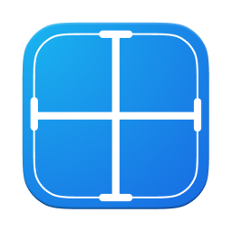
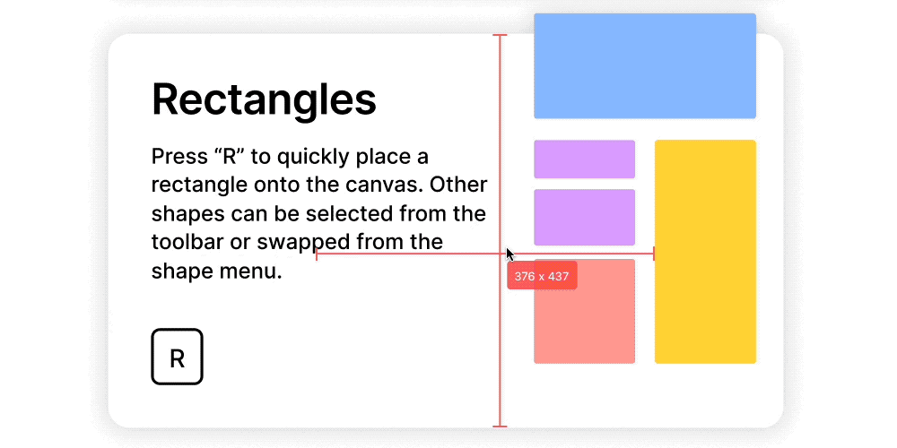

	
	<h1>PixelsMeasure</h1>
	

		<b>Measure anything on your screen</b>
	

	 
	 
	 

[PixelsMeasure](https://apps.apple.com/app/pixelsmeasure/id1638740542) works on the whole screen, across all apps, and you can measure anything.

Upgrade your measurement experience with PixelsMeasure now!

## Download

Requires macOS 13 or later.

## Features

* Measure distance: Quickly determine the distance between any elements on your screen
* Measure objects: Instantly identify the bounds of any object by simply dragging an area around it
* Cross mode: Ensure perfect alignment of all elements on your screen, which also displays your pointer position
* Tolerance mode: Adjust tolerance for improved accuracy, even with shadows and low-contrast elements
* Hold dimensions: Hold dimensions on the screen for reference
* User-friendly editing: Effortlessly undo and redo your measurements with our add edit tool
* Convenient screenshot capture: Easily take screenshots and share them with your team with system screenshot tool
* Multi-monitor support: Enjoy seamless operation across multiple monitors
* Global accessibility: PixelsMeasure supports multiple languages, making it accessible to users around the world

## Contributing Bug Reports

GitHub is used for bug tracking. Please search [existing issues](https://github.com/zddhub/PixelsMeasure/issues) and create a new one if the issue is not yet tracked.

## Download

Requires macOS 13 or later.