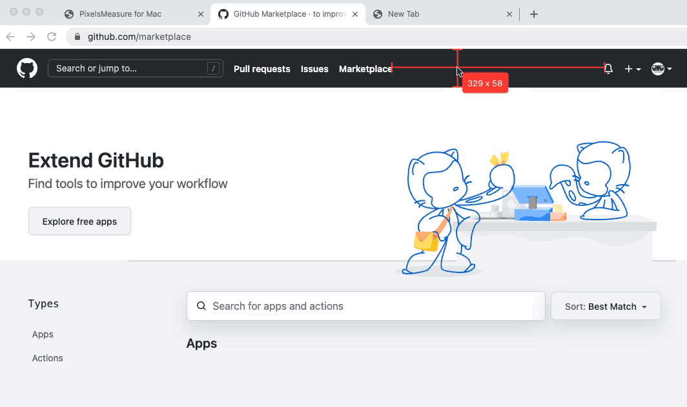

	
	<h1>PixelsMeasure</h1>
	

		<b>Measure anything on your screen</b>
	

	 
	 
	 

[PixelsMeasure][Apple_Store] works on the whole screen, across all apps, and you can measure anything.

Upgrade your measurement experience with PixelsMeasure now!

## Download

[][Apple_Store]

Requires macOS 13 or later.

## Features

* Measure distance: Quickly determine the distance between any elements on your screen
* Measure objects: Instantly identify the bounds of any object by simply dragging an area around it
* Cross mode: Ensure perfect alignment of all elements on your screen, which also displays your pointer position
* Tolerance mode: Adjust tolerance for improved accuracy, even with shadows and low-contrast elements
* Hold dimensions: Hold dimensions on the screen for reference
* User-friendly editing: Effortlessly undo and redo your measurements with our edit tool
* Convenient screenshot capture: Easily take screenshots and share them with your team with the system screenshot tool
* Multi-monitor support: Enjoy seamless operation across multiple monitors
* Global accessibility: PixelsMeasure supports multiple languages, making it accessible to users around the world

## Keyboard shortcuts

You can use the following keyboard shortcuts in the app:

* Start Measure: `Ctrl + Command + Shift + P`
* Stop Measure: `Escape`
* Cross Mode: Hold `Ctrl`
* Hold Horizontal: `H`
* Hold Vertical: `V`
* Hold Both: `B`
* Tolerance Toggle: `T`
* Tolerance Increase: `=`
* Tolerance Decrease: `-`
* Undo: `Command + Z`
* Redo: `Command + Shift + Z`
* Quit: `Command + Q`

You can customize your shortcuts under `Settings... -> Shortcuts` screen.

## Tips

- Open `Help -> Onboarding Guide` menu to explore major features and get started quickly.
- Adjust tolerance to work with shadows and low-contrast elements.
- Press `Command + Q` to quit the App at any time.

## Screenshots

See more screenshots [here](https://github.com/zddhub/PixelsMeasure/tree/main/assets/images/screenshots).

## Resources

- [Apple Store][Apple_Store]
- [YouTube](https://youtu.be/Y7_aRwq7gz4)
- [bilibili](https://www.bilibili.com/video/BV1WM411P71r)

## Privacy Policy

PixelsMeasure collects no information from users. The app runs entirely in a sandbox and does not have access to any data outside of the sandbox. The app also does not use any backend services, third-party analytics or tracking services.

See detailed [Privacy Policy](Privacy.md) for PixelsMeasure](Privacy.md).

## Contributing Bug Reports

GitHub is used for bug tracking. Please search [existing issues](https://github.com/zddhub/PixelsMeasure/issues) and create a new one if the issue is not yet tracked.

## Download

[][Apple_Store]

Requires macOS 13 or later.

[Apple_Store]: https://apps.apple.com/app/pixelsmeasure/id1638740542